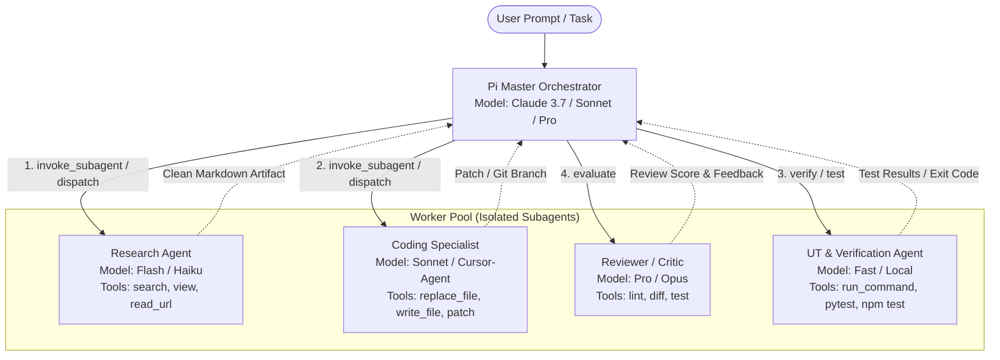
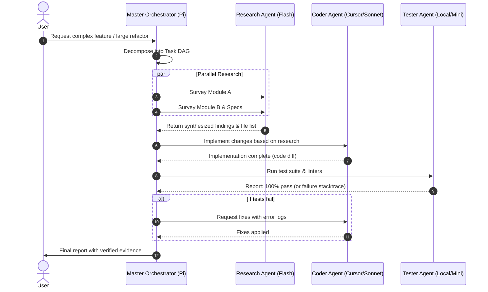

# Multi-Agent Orchestrator Plan for `pi-agent-stack`

**Status:** Implemented (2026-09-25)  
**Target Package:** `packages/pi-orchestrator`

---

## 1. Overview & Context

`pi-agent-stack` operates primarily as a single-turn / single-agent REPL loop (`@earendil-works/pi-coding-agent`). While it features advanced model routing (`pi-jev-harness`), multi-account subscription pooling (`pi-subscription-providers`), context pruning (`pi-dcp`), and test-driven reinforcement (`pi-rl-engine`), handling complex or large-scale tasks currently burdens a single agent context.

### The Problem
- **Context Pollution & Lost-in-the-Middle**: Running research, file edits, testing, and reviews in a single context window inflates token usage and degrades reasoning.
- **Cost Inefficiency**: High-tier models (Claude 3.7 Sonnet / Opus) are needlessly used for basic reading or grep tasks.
- **Lack of Parallelism**: Independent subtasks (e.g., surveying multiple modules or reading multiple documentation sources) run sequentially.

### The Goal
Implement a modular, state-driven **Multi-Agent Orchestrator** in `pi-agent-stack` that enables the master Pi agent to coordinate specialized subagents with isolated context scratchpads, role-scoped tools, cost-aware model assignment, and parallel/sequential execution DAGs.

---

## 2. Architecture & Design

### 2.1 Supervisor-Worker Pattern with Private Scratchpads



### 2.2 Core Architectural Principles

1. **Context Isolation (Private Scratchpads)**:
   - Subagents execute in dedicated execution environments / processes.
   - Internal tool steps, raw search results, and logs remain in the subagent's private scratchpad.
   - Only the structured output (Artifact / Summary / Diff) is returned to the Master Orchestrator.
2. **Cost-Aware Dynamic Model Assignment**:
   - **Research/Exploration**: Assigned to ultra-cheap, fast models with large contexts (`gemini-2.5-flash`, `claude-3-5-haiku`).
   - **Coding/Refactoring**: Assigned to capable coding models via subscription pools (`cursor-agent`, `claude-sonnet`).
   - **Master Planning & Review**: Handled by frontier reasoning models (`claude-3.7-sonnet`, `gemini-pro`).
3. **Tool Scoping (Single Responsibility)**:
   - Each subagent receives 3–5 high-signal tools relevant to its role, preventing tool distraction and parameter hallucination.

---

## 3. Package Design: `packages/pi-orchestrator`

### 3.1 Subagent Roster Definition

| Agent Role | Primary Focus | Scoped Tools | Default Model Class |
| :--- | :--- | :--- | :--- |
| **`researcher`** | Codebase navigation, docs lookup, web search | `view_file`, `search_web`, `read_url`, `read_codebase` | `flash` |
| **`coder`** | File editing, refactoring, bug fixing | `write_to_file`, `replace_file_content`, `patch` | `cursor-agent` / `sonnet` |
| **`tester`** | Build execution, test suites, coverage reporting | `run_command` (restricted), `read_test_report` | `local` / `mini` |
| **`reviewer`** | Code diff review, clean code standards, security check | `git_diff`, `read_spec`, `lint_check` | `pro` / `opus` |

### 3.2 Master Agent Tools

```typescript
export interface SubagentTask {
  name: 'researcher' | 'coder' | 'tester' | 'reviewer' | string;
  role: string;
  prompt: string;
  modelOverride?: string;
  tools?: string[];
  isolatedWorkspace?: boolean;
}

export interface InvokeSubagentParams {
  subagents: SubagentTask[];
  parallel?: boolean;
}
```

- **`invoke_subagent`**: Spawns one or more subagents in parallel or sequence, waiting for final artifacts.
- **`send_subagent_message`**: Sends intermediate guidance to an active subagent.
- **`manage_subagent`**: Controls lifecycle (`list`, `status`, `kill`).

---

## 4. Execution Flow & Lifecycle



---

## 5. Implementation Roadmap

1. **Phase 1: Subagent Process Spawner & Runtime**
   - Implement `SubagentManager` in `packages/pi-orchestrator` to spawn isolated child processes.
   - Establish JSON-RPC / IPC communication protocol between Master and Subagents.
2. **Phase 2: Jev Routing & Subscription Integration**
   - Bind subagent dispatching with `packages/pi-jev-harness` and `packages/pi-subscription-providers`.
   - Enable multi-account quota allocation for concurrent subagents.
3. **Phase 3: Evaluator-Optimizer & Reflection Loop**
   - Integrate feedback loops (e.g. Tester failure automatically triggering Coder retries).
   - Hook into `packages/pi-rl-engine` to record verified multi-agent trajectories.
4. **Phase 4: UI & Progress Monitoring**
   - Update `extensions/ember-ui.ts` to display multi-agent progress rails in the terminal.
   - Add `/agents` slash command for live inspectability.
